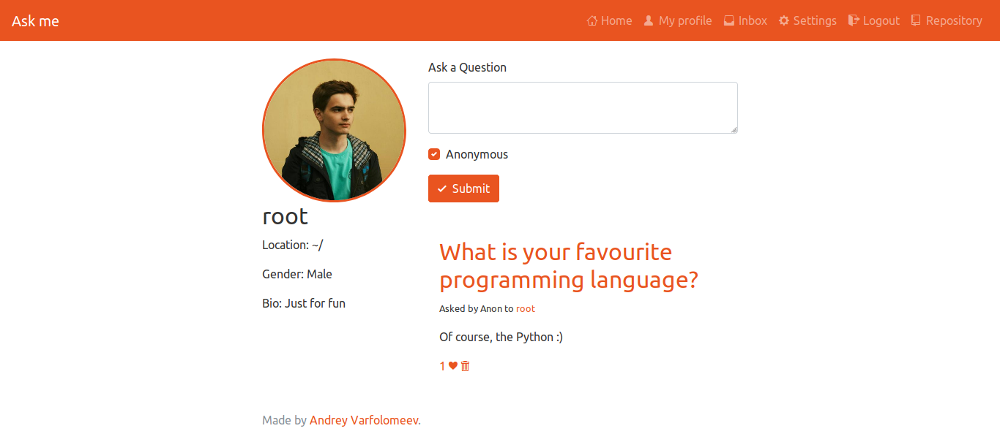

# Ask me

The web application for people who likes to ask questions and get answers from others.

Add .env. For developping I'm using this:

    DJANGO_DB_NAME=askme
    DJANGO_DB_USER=askme
    DJANGO_DB_PASSWORD=askme
    DJANGO_DB_HOST=db
    DJANGO_DB_PORT=5432
    DJANGO_SETTINGS_MODULE=config.dev_settings

For build and run, use:

    docker-compose build && docker-compose up
